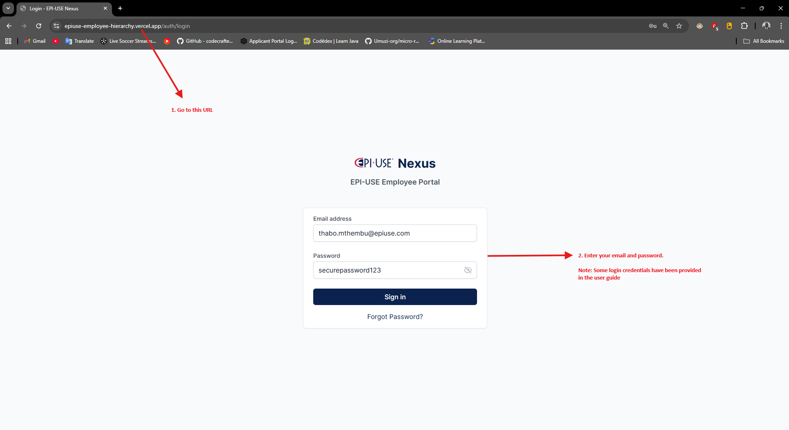
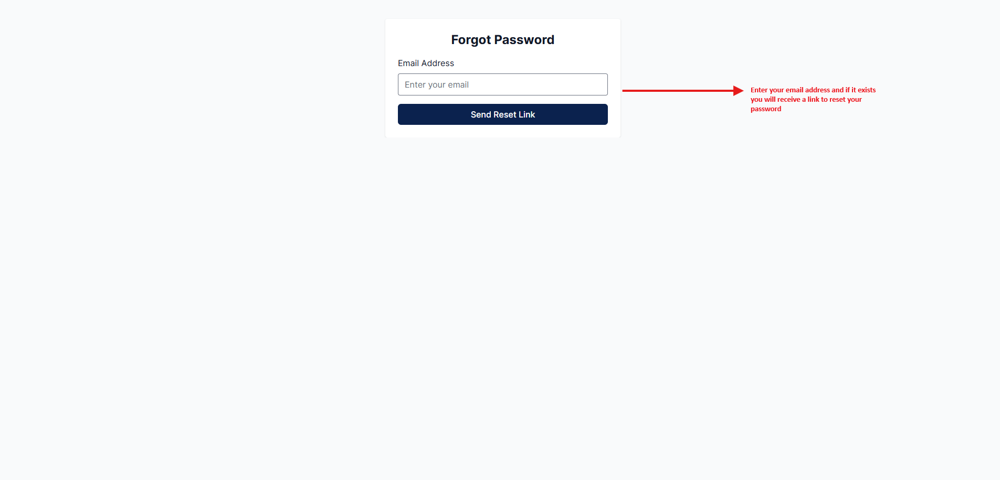
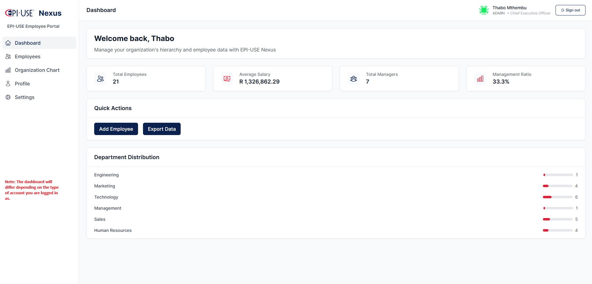
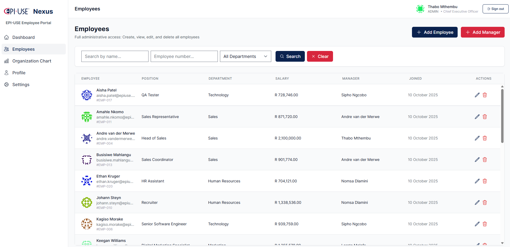
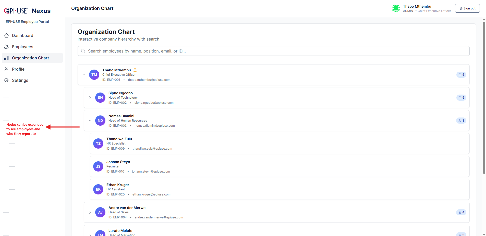
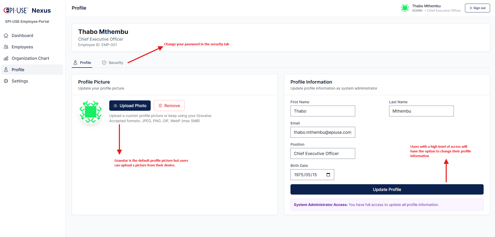
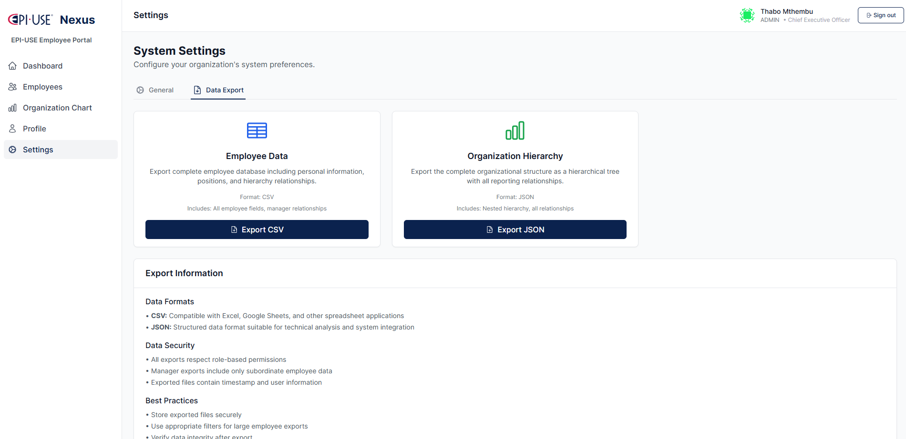

  

# EPI-USE Employee Hierarchy Platform – User Guide

## Accessing the App

1. **Open the App:**  
  Go to this URL: https://epiuse-employee-hierarchy.vercel.app/

2. **Login:**  
   Enter your email and password.

   ### Example Login Accounts

   - **Admin:**
     - Email: thabo.mthembu@epiuse.com
     - Password: securepassword123

   - **Manager:**
     - Email: sipho.ngcobo@epiuse.com
     - Password: securepassword123

   - **Employee:**
     - Email: kagiso.morake@epiuse.com
     - Password: securepassword123

   

3. **Forgot Password:**  
   Click "Forgot Password" to reset via email if needed.
   

---

## Dashboard

- After login, you land on the dashboard.
- See organization stats, quick actions, and navigation.
- **For Managers:** View direct reports, indirect reports, and total team size metrics.
- **For Admins:** See organizational overview including total employees, managers, and department distribution.
- Example:  
  

---

## Employees Page

- View all employees (or team members based on your role).
- Sort and filter by name, employee number, department, etc.
- Search for employees using multiple criteria.
- **Add Employees:**
  - **Admin:** Select department, then assign to available managers in that department.
  - **Manager:** Add employees to your department (auto-assigned to you).
- **Add Managers/Sub-Managers:**
  - **Admin:** Create new managers, assign them to CEO or other managers.
  - **Manager:** Add sub-managers to your department (they report to you).
- Edit or delete employees (if permitted by your role).
- **Salary Input:** Enter any valid salary amount without restrictions.
- Example:  
  

---

## Organization Chart

- Visualize the reporting structure as a tree.
- Click nodes to view employee details.
- Example:  
  

---

## Profile

- View and update your personal info.
- Change your password.
- Upload or remove your profile picture, or use Gravatar(defaut).
- Example:  
  
  

---

## Data Export (Admins)

- Export employee data as CSV or JSON.
- Example:  
  

---

## Settings (Admins)

- Company info

---

## Logout

- Click "Sign out" log out.

---

## Role-Based Features

- **Admin (CEO):** 
  - Full access to all features
  - Create, edit, and delete employees across all departments
  - Add managers and assign them to departments
  - Export data (CSV/JSON)
  - View all salaries and organizational metrics
  - When adding employees, select department and assign to managers in that department
  
- **Manager:** 
  - View and manage direct and indirect reports
  - Dashboard shows: direct reports, indirect reports, and total team size
  - Add employees and sub-managers to your own department
  - When adding sub-managers, department is pre-filled and locked to your department
  - View team member profiles and salaries (for your team)
  - Update employee information within your team
  
- **Employee:** 
  - View your own profile and personal information
  - See the organization chart
  - Connect with colleagues and view team directory
  - Update your own profile information and password
